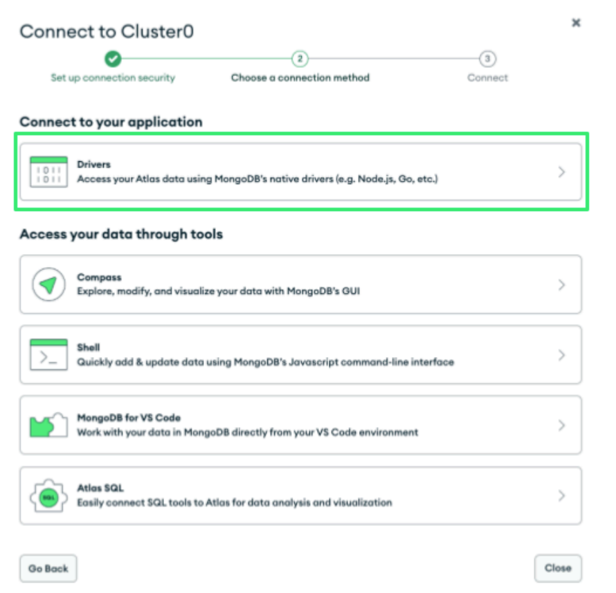
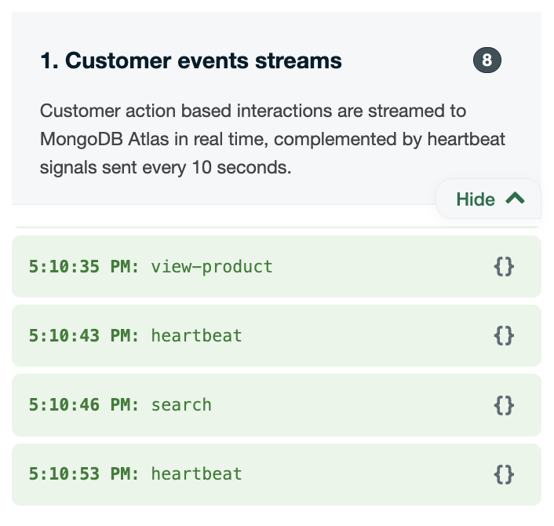
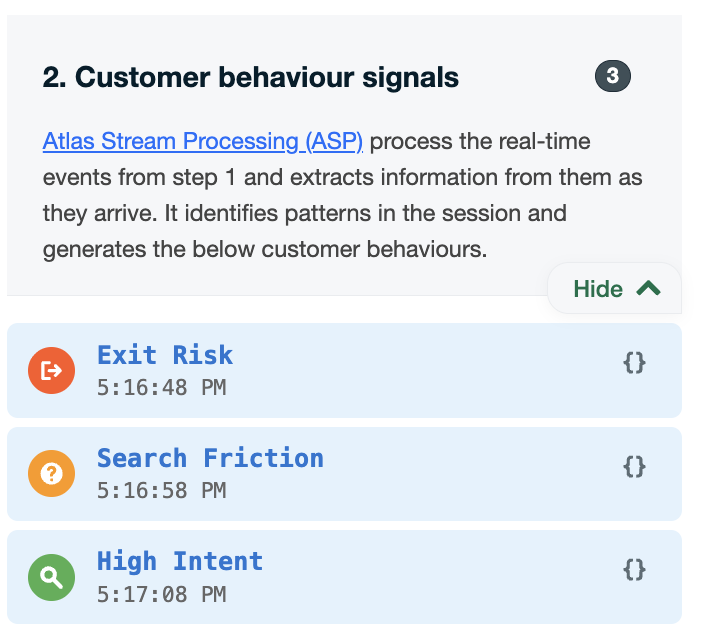
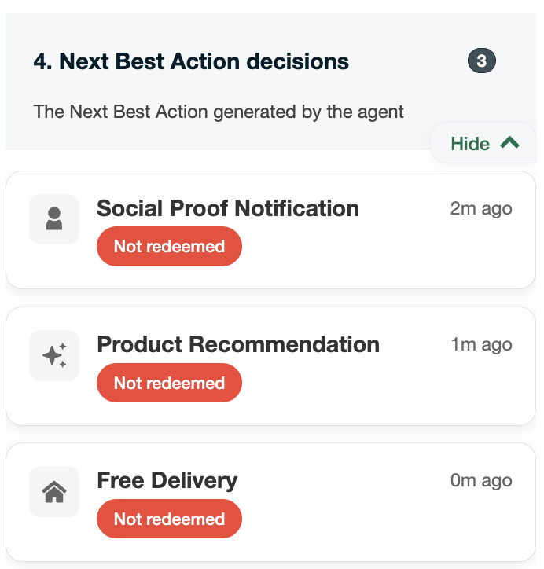
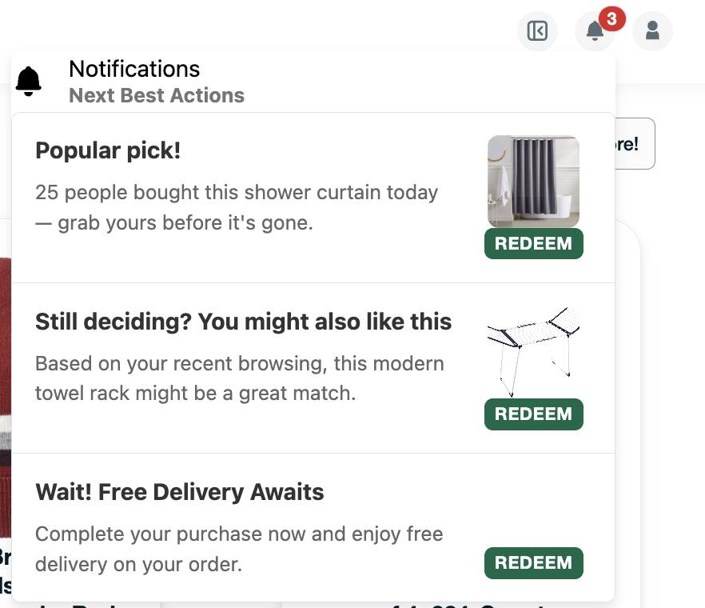
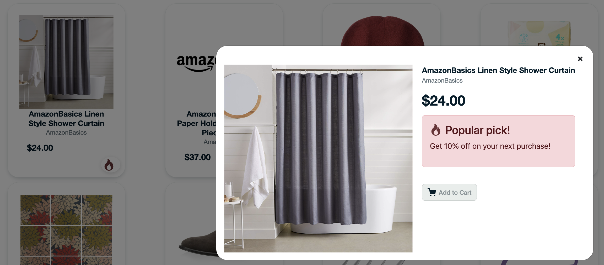

# Complex event processing (CEP) for customer retention

## Table of Contents
<details>
  <ol>
    <li><a href="#prerequisites">Prerequisites</a></li>
    <li><a href="#initial-configuration">Initial Configuration</a></li>
    <li><a href="#demo-overview">Demo Overview</a></li>
    <li><a href="#authors-&-contributors">Authors & Contributors</a></li>
    </ol>
</details>

> This guide covers the storefront side of the retention feature. The full
> pipeline (Atlas Stream Processing, the Azure AI Foundry agents, and the
> Microsoft Fabric churn scoring) is set up from the
> [repository README](../../../README.md), which sequences everything end to end.
> Use that as your primary guide; this file focuses on getting the storefront
> running against a seeded database.

## Prerequisites

Make sure to have the following to follow along and run this demo in your own environment.
* MongoDB Atlas account. Create one at https://cloud.mongodb.com and provision a cluster.
* Atlas Stream Processing configured (turns storefront events into behavioral signals). See [external/atlas-stream-processing/README.md](../../../retail-customer-retention-backend-main/external/atlas-stream-processing/README.md).
* The retention backend running (the Azure AI Foundry agents that generate the offers). See the [repository README](../../../README.md) and the [backend README](../../../retail-customer-retention-backend-main/README.md).
* A VoyageAI API key for product semantic search. Get one at https://www.voyageai.com.
* Node and Git installed.

## Initial Configuration

### Step 1. Clone the repository
Start by obtaining the demo code. Open your terminal, navigate to the directory where you want to store the code, and run the following command:

git clone https://github.com/mongodb-industry-solutions/retail-store-v2.git

### Step 2. Set up environment variables and install dependencies
Navigate to the project directory and create a file called .env.local at the root level. This file is essential for managing configuration settings, especially when it contains sensitive information such as private keys.

```bash
cd retail-store-v2
touch .env.local 
```

Note: For Window's users, replace touch .env.local with echo $null >> .env.local 

Open the .env.local file that you just created, and add the following environment variables.

```bash
MONGODB_URI=
DATABASE_NAME=leafy_popup_store
NODE_ENV=development
VOYAGE_API_KEY=
RETENTION_BACKEND_URL=http://localhost:8000
```

See `EXAMPLE.env.local` at the storefront root for the full list, including the
optional chatbot and digital-receipt variables. `RETENTION_BACKEND_URL` points at
the retention backend (local: run it on `http://localhost:8000` with `PORT=8000`
so it doesn't clash with the storefront on 8080; Azure: the backend Container App FQDN) and is what the Fabric enrichment toggle calls.

Leave the MONGODB_URI blank for now, you will retrieve its value on Step 3. 

Install the node modules executing the following command:

```bash
npm install
```

This installation might take a few moments to complete, as all the required packages are being downloaded and installed into the project. Once the command finishes executing, a new folder named 'node_modules' will appear at the root level of the application code, containing the installed dependencies.

### Step 3. Retrieve your connection string
A MongoDB connection string is required to connect to the cluster you created in the 'Prerequisites' section. Follow the steps provided in [this article](https://www.mongodb.com/resources/products/fundamentals/mongodb-connection-string#:~:text=How%20to%20get%20your%20MongoDB,connection%20string%20for%20your%20cluster.) to retrieve your connection string. 

When choosing your connection method for MongoDB, select the option labeled 'Drivers', as illustrated in Figure 1.



Figure 1. Atlas screen to choose a connection method.

Once you select the 'Drivers' option copy the provided connection string. It should look something like this:

```bash
mongodb+srv...
```

Great job! Assign the connection string to the MONGODB_URI variable replacing <username> and <password> with your actual credentials and save the changes. Set `DATABASE_NAME` to the same value you will restore the seed into (this guide uses `leafy_popup_store`).

###  Step 4. Populate your database
The repo ships a seed database so you do not have to build the catalog yourself. In the application code locate the `dump/leafy_popup_store` directory. It contains gzipped `.bson`/metadata files for the collections: users, products, orders, carts, locations, invoices, and recommendations. The products already include VoyageAI embeddings (`vai_text_embedding`), so semantic search works once the vector index exists (next step).

Use [mongorestore](https://www.mongodb.com/docs/database-tools/mongorestore/) to load the seed. Navigate to `/retail-store-v2` (the storefront root) and run:

```bash
mongorestore --gzip --dir=dump/leafy_popup_store --db=leafy_popup_store --uri "mongodb+srv://..."
```

The `--db` value must match `DATABASE_NAME` in your `.env.local`. This creates the database and collections and logs its progress. When it finishes you will have the full catalog (760 products) plus the supporting collections.

**Create the search indexes.** Product search needs an Atlas Vector Search index and a text search index on the `products` collection. See the [Atlas setup guide](../../../docs/ATLAS_SETUP.md) for the exact index definitions (the vector index is `vs_index_vai_text_embeddings` on `vai_text_embedding`, 1024 dimensions, cosine). Without them, search returns empty results with no error.

You now have the storefront configured and the database seeded with the catalog.

###  Step 5. Set up the retention backend
The retention offers are generated by the Azure AI Foundry agents in the retention backend, which watches Atlas for behavioral signals and writes Next Best Actions back. The storefront reaches it through `RETENTION_BACKEND_URL`. Set it up with the [repository README](../../../README.md) and the [backend README](../../../retail-customer-retention-backend-main/README.md). The signals themselves come from Atlas Stream Processing, configured per [external/atlas-stream-processing/README.md](../../../retail-customer-retention-backend-main/external/atlas-stream-processing/README.md).

###  Step 6. Run the demo
Start the storefront from the root of the application code:

```bash
npm run dev
```

Then open:

```
http://localhost:8080/shop?feature=customerRetention
```

The `?feature=customerRetention` flag is required to enable the retention panels, signals, and offers. Without it you see the plain storefront.

Congratulations! Browse products, search, and dwell on a full cart to see the behavioral signals turn into Next Best Actions in real time.

## Demo Overview

### Understanding the shopping page

In this page we are demonstrating how the Leafy PopUp ecommerce captures and analyses real-time customer behaviour while browsing through the catalog. And generate reactive measures in the form of Next Best Actions, to keep the customer engaged and retain them.

The system captures customer behavior events during an active user session to enable real-time processing and trigger Next Best Actions.

**Demo Controls Inside the navbar:**
- **Expand Icon** - Toggles a sidebar that showcases some of the behind the scenes collections and processes happening in the back.
- **Bell Icon** - Opens the notifications menu where we are displaying the 'Next Best Actions (NBA)' generated. NBA are all centralized on this notification menu, however some of them can be present in other places like the product details to show another example of what the NBA can trigger/do.

### 1. UX events streams
**Sending real-time heartbeats and action based events**

In retail and digital commerce systems, customer behavior is typically observed through:
- Action-based events (clicks, navigation, cart interactions)
- Lightweight engagement signals to indicate session presence and activity

Perform any of the actions mentioned in the table below and map them to the "UX events streams" section on the right side. Click on the CurlyBraces icon to see the full document.

| Event type | Perform the following to emit this event | What it represents |
|------------|-------------------------------------------|-------------------|
| **View product** | Click a product card to open its detailed view | Product-level interest and intent discovery. |
| **Add to cart** | Click the Add to Cart button found inside the details of the product. | Strong purchase intent signal. |
| **Exit intent** | Click on the LogOut icon at the rightmost side of the navbar, and hover your mouse over the "Log out" area. | Potential abandonment risk. |
| **Heartbeat** | No action needed, sent periodically (every ~10 seconds). | Continued session presence and activity. |



### 2. Customer behaviour signals
**Finding Complex Event Patterns (CEP) from the events to identify customer behaviour signals**

This section will start auto populating as you continue to interact on this page.

In this demo we have three possible signal types identified:

| Signal Type | What it represents | Why it matters |
|-------------|-------------------|----------------|
| **High Intent** | The customer is actively considering a specific purchase | Opportunity to remove doubt and accelerate conversion |
| **Search Friction** | The customer is trying to find something but isn't progressing | Best moment to help before frustration turns into abandonment |
| **Exit Risk** | The customer is likely to leave without converting | Last chance to retain (recover cart, save intent, assist immediately) |

It's important to note that signals are not calculated on linear rules but, based on a behavioral algorithm that looks at intensity and direction in user behavior. 

You can see these signals listed inside the 'Customer behaviour signals' section, click on the curly bracket icon to see the full document.



### 3. Agent reasoning

A lightweight agent takes the session signals and decides which is the best Next Best Action.

In this demo we have three possible Next Best Action types from which the agent can pick based on the signals that it reads.

### 4. Next Best Action decisions
**The Next Best actions generated by the agent**

This section will start auto populating as the agent creates Next Best Actions to send to the customer.

You will see the Next Best Actions listed inside this section.



**How will the customer look at these NBAs?**

NBAs are displayed inside the navbar as Notifications



Also for some NBA that are for a specific product, in addition to the notification you will be able to see it inside the product details as well as with a Fire icon on the product card.



### Demo Walkthrough

Below are three clear scenarios you can try to get Next Best Actions.

**Scenario 1 — High Intent**
- **Sequence:** search → view-product → add-to-cart (same category/topic)
- **Show:**
  - baseline high intent detection
  - Decision layer writes NBA: "Complete your purchase" or "Recommended matching item"

**Scenario 2 — Search Friction**
- **Sequence:** search → search → search without cart/progress
- **Show:**
  - baseline friction detection
  - Decision layer writes NBA: recommendations or top alternative items

**Scenario 3 — Exit Risk**
- **Sequence:** add-to-cart then exit-intent
- **Show:**
  - urgent signal
  - Decision layer writes NBA: "Don't forget your cart" or similar retention action

## Authors & Contributors

### Lead Authors   
[Rodrigo Leal](https://www.mongodb.com/blog/authors/rodrigo-leal) - Principal

[Genevieve Broadhead](https://www.mongodb.com/blog/authors/genevieve-broadhead) - Global lead, retail solutions

[Angie Guemes](https://www.mongodb.com/developer/author/angie-guemes-estrada/) – Developer & Maintainer 

[Florencia Arin](https://www.mongodb.com/blog/authors/florencia-arin) – Developer & Maintainer 
